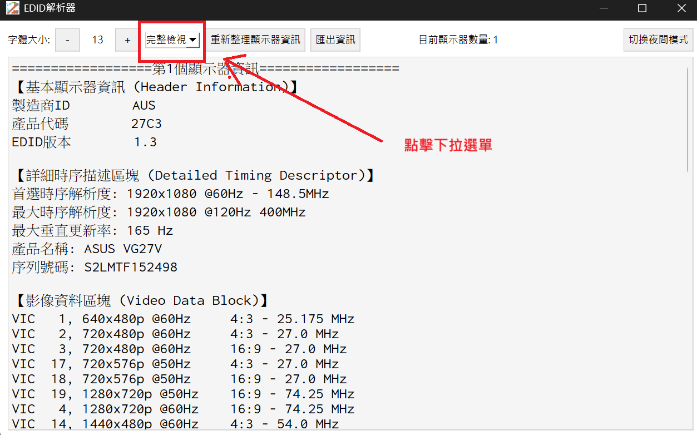
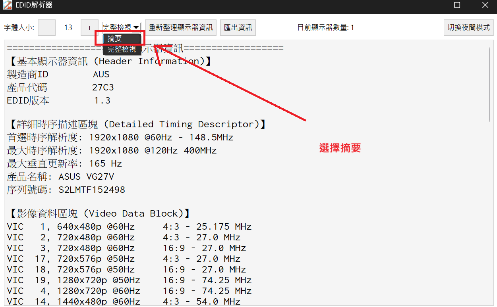
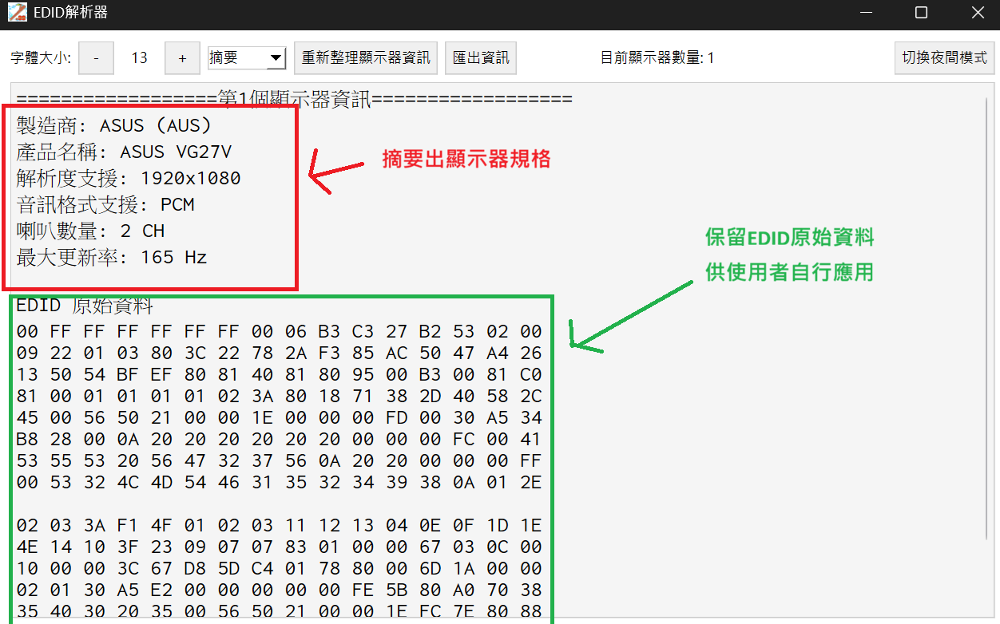

# EDID Sample Parser

* 適用於windows系統
* 允許讀取現代高規顯示器的EDID，能超過2個blocks
* 支援Standard EDID、DisplayID、CTA(CEA)
* 資訊即時匯出

## 🚀 快速開始

### 系統需求

* Windows 10/11
* 須同意系統管理員權限(讀取後台API)
* 無需安裝額外軟體，下載即可使用

### 下載與安裝

#### 主程式

* [EDID解析器 v2.0.0.exe](<dist/EDID解析器 v2.0.0.exe>)(35MB) - 下載即用

> 💡 **提示**:
>
> * 首次執行時Windows可能會顯示安全警告，屬正常現象
> * 技術文件為一次性下載，後續版本更新無需重複下載

## 🖼️ 應用程式預覽

### 程式圖示


### 日間模式介面


### 夜間模式介面


### 顯示器數量檢測


### 更新資訊


### 匯出功能


**TXT格式輸出範例：**


**HTML格式輸出範例：**


## What's New

### `摘要`(已預設為啟用畫面)

提供更簡潔的方法得到有用的資訊，請善加利用~

1. 點選`下拉選單`


2. 選擇`摘要`


3. 即可顯示`摘要內容`


## Future Plans

1. 歷史紀錄清單

    在[Pro版本](<https://github.com/z1234777888/edid_reader_pro_master/blob/main/dist/EDID%20Reader%20Pro%20Master%20v1.3(header%E8%A7%A3%E6%9E%90%E5%A4%B1%E6%95%97%E5%BE%8C%E4%BB%8D%E5%8F%AF%E9%81%8B%E8%A1%8C%E7%89%88).exe>)有提供該功能，但我認為程式碼已經擁腫到無法修改，因此在此簡易版本尚未實現

    * 分割同一份資料中的多個顯示器到個別的json
    * 每個顯示器保留三次歷史讀取紀錄(for EDID adjust debug)

1. EDID獨立匯出

    該功能目前獨立於[這裡](<https://github.com/z1234777888/eidid_reader/tree/7e2635f705051f3a7188add630187d95b5956dce/dist>)，未來預計會將他加入到主程式

    * 勾選匯出夾帶的資訊:匯出時間、分隔線、顯示器名稱

1. EDID匯入並解析

    [Pro版本](<https://github.com/z1234777888/edid_reader_pro_master/blob/main/dist/EDID%20Reader%20Pro%20Master%20v1.3(header%E8%A7%A3%E6%9E%90%E5%A4%B1%E6%95%97%E5%BE%8C%E4%BB%8D%E5%8F%AF%E9%81%8B%E8%A1%8C%E7%89%88).exe>)有提供該功能，支援非當前顯示器的EDID解析，可以用來分析EDID的正確性以及客人的顯示器規格，目前僅支援使用[EDID Formater](<https://github.com/z1234777888/edid_raw_data_formater/blob/95028c23a25c96992dbdcdf6aa032f871df27cad/dist/EDID%E6%A0%BC%E5%BC%8F%E5%8C%96%E5%B7%A5%E5%85%B7%20v1.1.exe>)轉換過的內容格式

    * 內建format功能:以利解析功能完整呈現

## 📚 技術參考

### 包含的規格文件

本專案參考以下開源標準規格，文件可從Release頁面個別下載：

| 規格名稱 | 檔案大小 | 說明 |
|---------|---------|------|
|[VESA-EEDID-A2](./hdmi_spec/VESA-EEDID-A2.pdf) |(2MB)| - 基礎EDID格式規範|
|[HDMISpecification1.3a](./hdmi_spec/HDMISpecification1.3a.pdf) |(2MB) |- HDMI V1.3版規範|
|[CTA-861-I前段](./hdmi_spec/CTA-861-I保留前段.pdf) |(2MB) |- 前段是一般CTA規範|
|[CTA-861-I後段](./hdmi_spec/CTA-861-I保留ctaExtension.pdf)| (0.7MB) |- 後段是CTA擴展區塊(通常需搭配前段服用)|
|[DispID-v1_3](./hdmi_spec/DisplayID/DisplayID_v1.3/DispID-v1_3.pdf) |(6MB) |- DisplayID格式規範，目前只有取用TYPE I的timing解析(常見)|

### 版權說明

* 所有規格文件均為各標準組織公開發布的技術標準
* 僅供技術參考使用，版權歸原標準組織所有

## 📚 EDID技術背景

EDID（Extended Display Identification Data）是顯示器向圖形卡提供規格資訊的國際標準。每個EDID區塊都有特定的功能：

> 💡 **提示**:
>
> * 同一區塊同時只能存在一個，因此當遇到兩個相同開頭的區塊將只會解析其中一個
> * 規範中有寫到
>
>>>> 即使EDID異常，訊號源應至少顯示最低解析度的畫面
>
>但其實沒有硬性規定，所以就任憑各家廠商自行發揮
>
### Standard Block（標準區塊00 FF FF FF FF FF FF 00開頭）

* 包含基本顯示器資訊和首選解析度
* 必須為EDID的第一個區塊

### CTA Extension Block（CTA擴展區塊02開頭）  

* 包含支援的視訊格式（VIC）和音訊格式
* 提供CEA Physical Address用於CEC控制

### Display ID Block（Display ID區塊70開頭）

* 常見於HDMI 2.1規格顯示器
* 提供更詳細的時序解析度資訊

### 常見EDID問題診斷

* **擴充數錯誤** - 可能導致影音設備無法正確識別解析度
* **Checksum錯誤** - 使EDID被判定為無效，僅支援基礎解析度格式
* **VIC填寫缺漏** - 導致某些解析度無法選擇
* **CEA PA錯誤** - 造成CEC功能異常(有解析，但需自行驗證)
* **DTD Offset錯誤** - 造成容易造成解析度功能異常

## 🤝 貢獻與開發

### 給開發者

如果您想從原始碼執行或參與開發：

```bash
# 克隆專案
git clone https://github.com/z1234777888/edid_sample_parser.git

模組安裝
- PyQt6
- pyinstaller

# 執行程式
python edid_main.py
or
python pyqt_main.py
```

### 技術棧

* **語言**: Python 3.9+
* **GUI框架**: PyQt6
* **Windows API**: winreg, ctypes
* **打包工具**: PyInstaller

歡迎提交Issue和Pull Request來改善這個專案！

## 📄 授權條款

本專案基於開源EDID規格書開發，整合了多種開源協定。

## 📞 支援

如果您遇到問題或有建議，請在GitHub上提交Issue。

## 贊助

如果這對你的幫助勝過於每月的AI訂閱費用，請不吝嗇於支持我，因為這些看似簡單的小工具可能花費我半年甚至更多的時間完成

[Buy Me a Coffee](<https://buymeacoffee.com/z123477788e>)

---

*本工具幫助工程師更快速、準確地分析EDID資料，提升顯示器相關問題的排查效率。*
