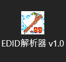
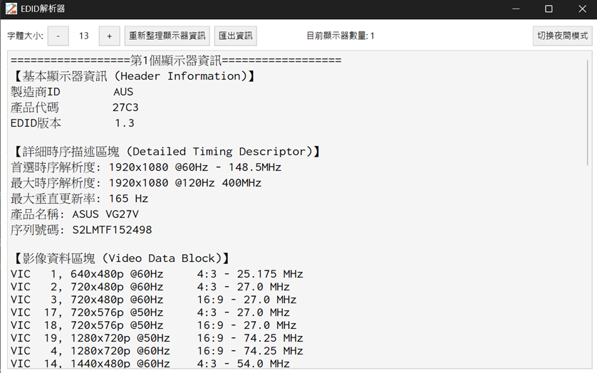
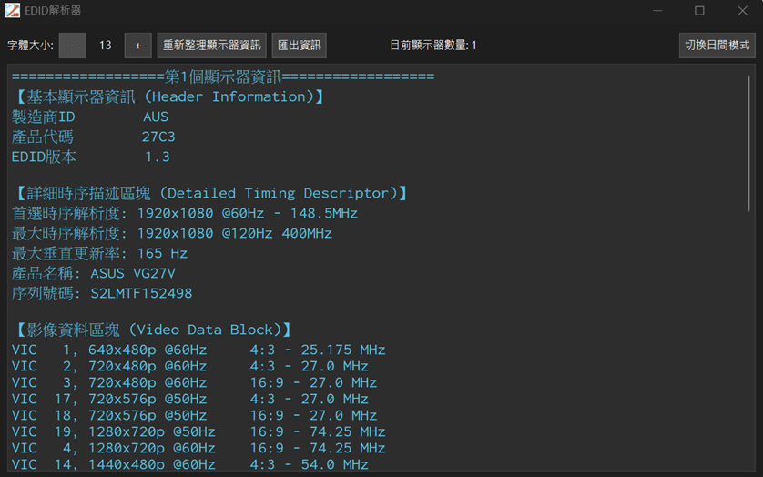
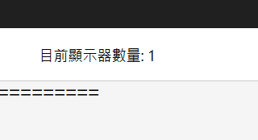
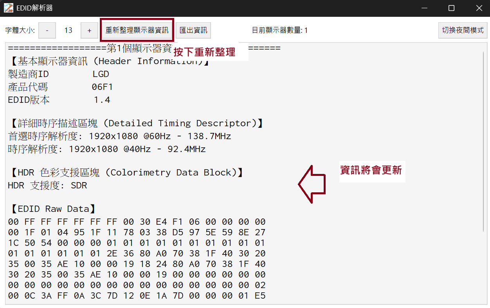
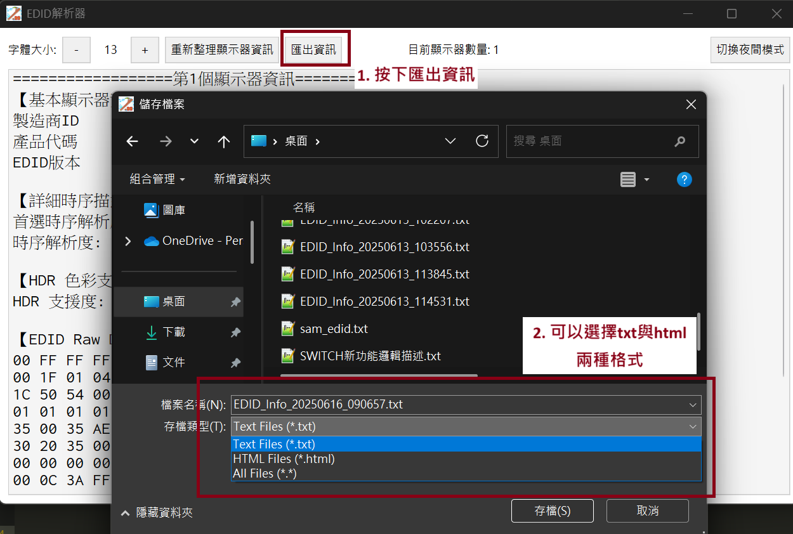
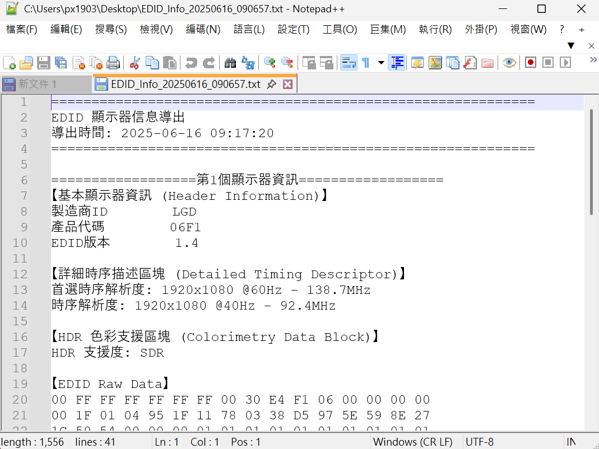
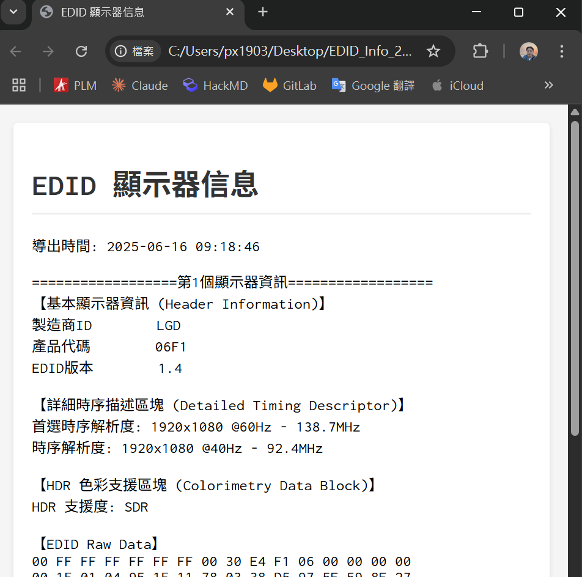

# EDID Reader

一個用於解析和分析EDID（Extended Display Identification Data）的Windows GUI工具，支援多種EDID格式並提供直觀的顯示器資訊檢視。

## ✨ 特色功能

- 🖥️ **即時讀取** - 自動檢測Windows系統中連接的顯示器EDID資訊
- 📊 **多規範支援** - 整合三種開源EDID協定解析
- 🌓 **雙主題模式** - 支援日間/夜間模式切換
- 📄 **報告匯出** - 支援TXT和HTML格式報告輸出
- 🔄 **即時更新** - 一鍵更新顯示器資訊

## 🚀 快速開始

### 系統需求

- Windows 10/11
- 無需安裝額外軟體，下載即可使用

### 下載與安裝

#### 主程式

- **[EDIDReader_v1.0.exe](./dist/EDID解析器%20v1.0.exe)** (35MB) - 下載即用
- 直接執行，無需安裝過程
- 建議放在專用資料夾中（匯出檔案預設為同一資料夾）

#### 技術規格文件（選用）

根據需要選擇下載相關規格：

- **[VESA E-EDID](./hdmi_spec/VESA-EEDID-A2.pdf)** (2MB) - 基礎E-EDID規範
- **[CTA-861前段](./hdmi_spec/CTA-861-I保留前段.pdf)** (1.81 MB) - CTA規範
- **[CTA-861後段](./hdmi_spec/CTA-861-I保留ctaExtension.pdf)** (0.7MB) - CTA擴充區塊
- **[HDMI v1.3規範](./hdmi_spec/HDMISpecification1.3a.pdf)** (1.93 MB)- HDMI技術規格
- **[Display ID V1.3規範](./hdmi_spec/DisplayID/DisplayID_v1.3/DispID-v1_3.pdf)** (1.93 MB)- 較新的EDID規範

> 💡 **提示**:
>
> - 首次執行時Windows可能會顯示安全警告，屬正常現象
> - 技術文件為一次性下載，後續版本更新無需重複下載

### 使用方法

1. **啟動應用程式** - 程式會自動顯示當前連接的顯示器資訊
2. **連接新顯示器** - 將顯示器透過HDMI或DisplayPort連接至電腦
3. **重新整理** - 點擊「重新整理顯示器資訊」按鈕更新資訊
4. **檢視詳細資訊** - 瀏覽解析出的完整顯示器規格
5. **匯出報告** - 點擊「匯出資訊」按鈕儲存分析結果

## 📋 支援的EDID格式

| 區塊類型 | 標識符 | 說明 |
|---------|--------|------|
| **Standard Block** | `00 FF FF FF FF FF FF FF 00` | EDID基本資訊區塊（必須為首個區塊） |
| **CTA Extension** | `02 03` | CTA-861擴展區塊 |
| **Display ID** | `70` | DisplayID格式區塊 |
| **Block Map** | `F0` | 區塊映射（解析後跳過該區塊） |

## 📊 解析資訊內容

完成解析後，您將獲得以下詳細資訊：

### 基本資訊

- **Header Info** - 基本顯示器資訊
- **DTDs** - 詳細時序描述區塊（Display Timing Descriptors）

### 視訊規格

- **VDB** - 視訊格式資料區塊（Video Data Block）
- **時序解析度** - 包含首選、最大解析度及垂直更新率

### 音訊規格  

- **ADB** - 音訊格式資料區塊（Audio Data Block）
- **SADB** - 聲道配置資料區塊（Speaker Allocation Data Block）

### 廠商資訊

- **VSDB** - 供應商特定資料區塊（Vendor Specific Data Block）
- **CEA Physical Address** - CEC功能所需的物理位址

## 🖼️ 應用程式預覽

### 程式圖示



### 日間模式介面



### 夜間模式介面



### 顯示器數量檢測



### 更新資訊



### 匯出功能



**TXT格式輸出範例：**


**HTML格式輸出範例：**


## 🔧 適用場景

- **顯示器製造商** - 驗證EDID資料正確性
- **系統整合商** - 排除顯示器相容性問題  
- **技術支援** - 快速診斷顯示器規格和問題
- **AV工程師** - 分析HDMI/DisplayPort連接問題

## 📚 技術參考

### 包含的規格文件

本專案參考以下開源標準規格，文件可從Release頁面個別下載：

| 規格名稱 | 檔案大小 | 說明 |
|---------|---------|------|
|[VESA-EEDID-A2](./hdmi_spec/VESA-EEDID-A2.pdf) |(2MB)| - 基礎EDID格式規範|
|[HDMISpecification1.3a](./hdmi_spec/HDMISpecification1.3a.pdf) |(2MB) |- HDMI V1.3版規範|
|[CTA-861-I前段](./hdmi_spec/CTA-861-I保留前段.pdf) |(2MB) |- 前段是一般CTA規範|
|[CTA-861-I後段](./hdmi_spec/CTA-861-I保留ctaExtension.pdf)| (0.7MB) |- 後段是CTA擴展區塊(通常需搭配前段服用)|
|[DispID-v1_3](./hdmi_spec/DisplayID/DisplayID_v1.3/DispID-v1_3.pdf) |(6MB) |- DisplayID格式規範，目前只有取用TYPE I的timing解析(常見)|

### 版權說明

- 所有規格文件均為各標準組織公開發布的技術標準
- 僅供技術參考使用，版權歸原標準組織所有

## 📚 EDID技術背景

EDID（Extended Display Identification Data）是顯示器向圖形卡提供規格資訊的國際標準。每個EDID區塊都有特定的功能：

### Standard Block（標準區塊）

- 包含基本顯示器資訊和首選解析度
- 必須為EDID的第一個區塊

### CTA Extension Block（CTA擴展區塊）  

- 包含支援的視訊格式（VIC）和音訊格式
- 提供CEA Physical Address用於CEC控制

### Display ID Block（Display ID區塊）

- 常見於HDMI 2.1規格顯示器
- 提供更詳細的時序解析度資訊

### 常見EDID問題診斷

- **擴充數錯誤** - 可能導致影音設備無法正確識別解析度
- **Checksum錯誤** - 會使EDID被判定為無效
- **VIC填寫缺漏** - 導致某些解析度無法選擇
- **CEA PA錯誤** - 造成CEC功能異常

## 🤝 貢獻與開發

### 給開發者

如果您想從原始碼執行或參與開發：

```bash
# 克隆專案
git clone https://github.com/Ken-Huang-PX/EDID_Reader
cd EDID_Reader\src

模組安裝
- PyQt6
- pyinstaller

# 執行程式
python edid_main.py
or
python pyqt_main.py
```

### 技術棧

- **語言**: Python 3.9+
- **GUI框架**: PyQt6
- **Windows API**: winreg, ctypes
- **打包工具**: PyInstaller

歡迎提交Issue和Pull Request來改善這個專案！

## 📄 授權條款

本專案基於開源EDID規格書開發，整合了多種開源協定。

## 📞 支援

如果您遇到問題或有建議，請在GitHub上提交Issue。

---

*本工具幫助工程師更快速、準確地分析EDID資料，提升顯示器相關問題的排查效率。*
