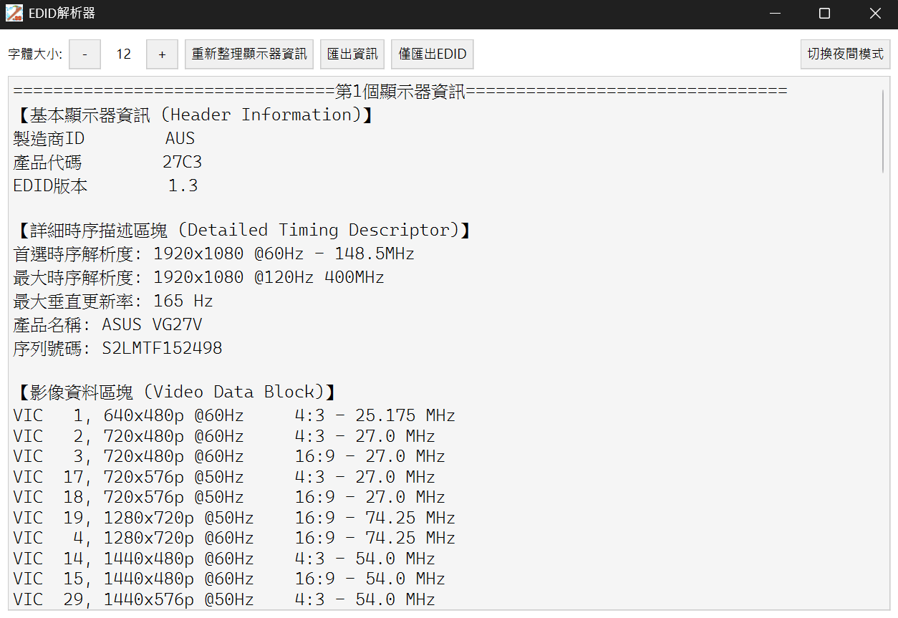
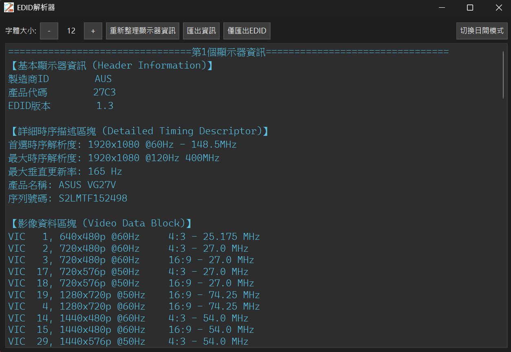
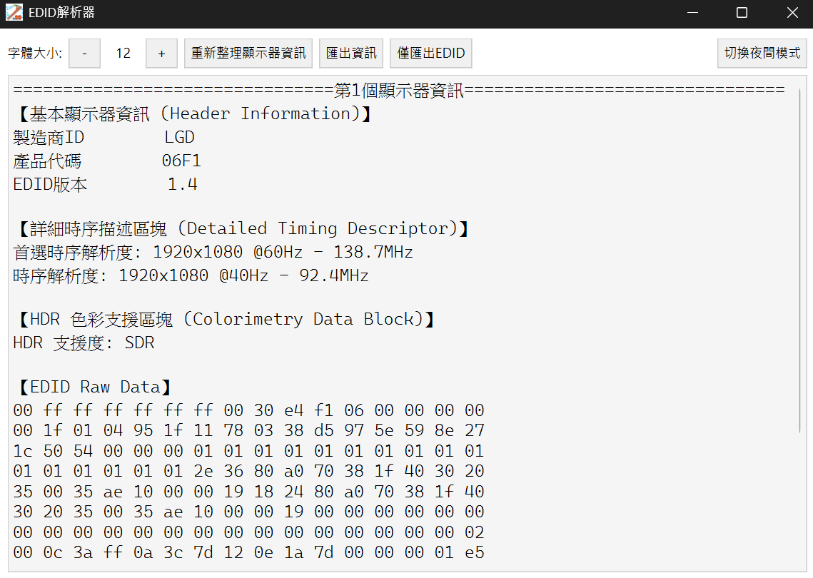
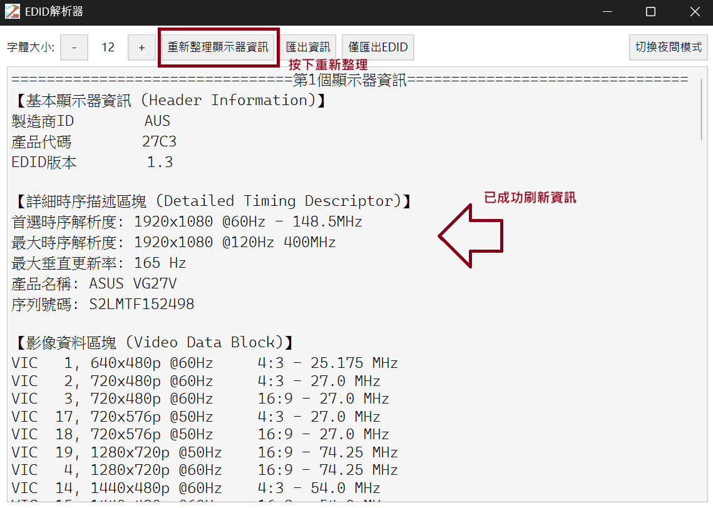

# EDIDREADER

EDID 解析器

## 介面

應用程式圖示

執行介面(日間模式)

執行介面(夜間模式)

## How to use

1. 先打開應用程式，他會先顯示你現在的螢幕資訊

    

2. 將顯示器插入電腦的HDMI或DP介面

3. 按下`重新整理顯示器資訊`按鈕

    你會看到內容更新，順序應該是依照註冊表的排序
    

4.

## 常見的block簡介

以block的開頭作為區分

* 標準區塊

        00 FF FF FF FF FF FF 00
* CTA擴充區塊

        02 03
* DisplayID區塊

        70
* BlockMap區塊

        F0

常見block格式

* 2.0之前

        標準
* 2.0

        標準+CTA擴充

* 2.0轉2.1過渡期

        標準+CTA擴充+DP
* 2.1之後

        標準+BlockMap+CTA擴充+DP
